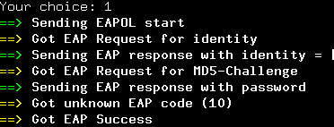

# Yah3c-for-CUIT
===

用与校园网认证客户端(成都信息工程大学航空港校区)

## 依赖
----------

* Python2.7
* 主流Linux发行版,未测试OpenWrt/DD-WRT

## 安装
-----------

从github上clone过来,后进行安装

```bash
# Ubuntu/Debian/Gentoo/Arch/Opensuse/...
git clone git://github.com/lifeand/yah3c-for-cuit.git
cd yah3c-for-cuit
sudo python setup.py install
```


## 认证
------------


* sudo [yah3c.py](/yah3c.py),帐号为自己的学号
* 程序运行时必须要有root权限：

###  认证成功
 


##Lincense
-------------
yah3c-for-cuit的代码使用MIT License发布，此外，禁止使用yah3c-for-cuit以及yah3c-for-cuit的修改程序用于商业目的（比如交叉编译到路由进行销售等行为）
